Control of an eight thruster Remotely operated Underwater Vehicle(ROV) model using LQR controller.

The PID controller has been one of the most commonly used controllers for a really long time. There have been numerous PID tuning techniques, such as the Ziegler-Nichols method but are insufficient for high-performance control applications. The Linear Quadratic Regulator (LQR) is an optimal control method based on full state feedback. It aims to minimise the quadratic cost function and is then applied to linear systems, hence the name Linear Quadratic Regulator. 

**Why LQR controller?**

The use of LQR  over PID control comes from the higher robustness of the former in terms of tuning the parameters with varying conditions. PID control uses the error in the input parameter of the closed loop system and tunes the parameters to reduce the error to zero. LQR, on the other hand, uses the state space model of the system and takes complete state feedback: -Kx, to calculate the error. LQR uses the method of cost function to calculate the control input cost vs the importance of achieving desired states.

**State-Space Model with Full State Feedback Gain:**

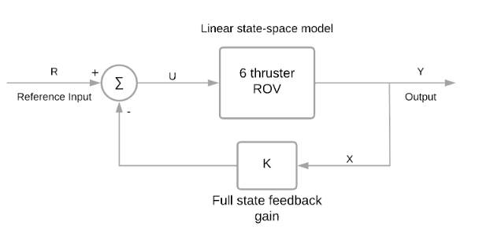

Ẋ = AX + BU
y = CX+DU

**Cost Function:**
The cost function defined by the system equations is minimised by the LQR controller using an optimal control algorithm. The cost function involves the system's state parameters and input (control) parameters, along with the Q and R matrices. For the optimal LQR solution, the overall cost function must be as low as possible. The weights given to the state and control parameters are represented by the Q and R matrices, which act as knobs whose values can be varied to adjust the total value of the cost function. 

The system must have a linearized state-space model to solve the LQR optimization problem. The cost function to be optimised is given by

𝐽 = ∫ (𝑋T𝑄𝑋 + 𝑈T𝑅𝑈)𝑑t

**Algebraic Riccati Equation and Its Solution(S matrix):**

The Q and R matrices are used to solve the Algebraic Riccati Equation (ARE) to compute the full state feedback matrix.

𝐴T𝑆 + 𝑆𝐴 − 𝑆𝐵𝑅-1𝐵T𝑆 + 𝑄 = 0

On solving the above equation, we obtain the matrix 𝑆.

**Feedback Gain (K) and Eigen Values from S matrix:**

The matrix 𝑆 obtained from the above ARE is used to find the full state feedback gain matrix K using the relation,

𝐾 = 𝑅-1𝐵T𝑆

The control matrix U is then given by

U = - KX

**Linearisation of a state-space model:**

The linearization of a state-space model is needed while using the LQR technique since it works on linear systems. In our case, the state space model is in the form: ẋ = f(x); where f(x) is a nonlinear function of x. In such cases, to linearise the equation, we use the concept of linearising about a fixed point. The steps for the same are as follows:
Find the fixed points x̄ ; where  f(x̄) = 0.
Linearise about an x̄, by calculating the Jacobian of dynamics at the fixed point x̄; where the latter can be represented as:

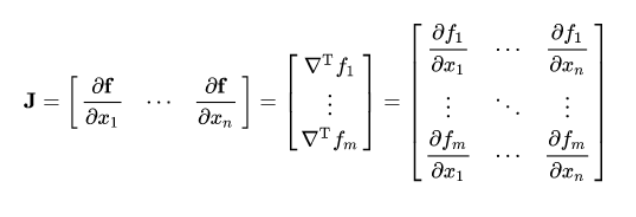

where each term is a partial derivative of the dynamics with respect to a variable.
This step is executed since the dynamics of a nonlinear system behave linearly at the fixed point, or, in a small neighborhood around the fixed point. 

Changing the frame of reference to one with x̄ as the origin:
 ẋ -ẋ̄  = f(x)
         = f(x̄) + J.(x -x̄) + J2.(x-x̄)2 + . . . . .  

where   J  is calculated at x̄.
The higher order terms from the third term  J2.(x-x̄)2 are neglected since they are really small, hence the equation reduces to:
 
  ∆ẋ = 0 +J.∆x + 0 
 ⇒ ∆ẋ = J.∆x  

This is in the form  ẋ = Ax

**Note:** The above method for linearization works only when the fixed point satisfies the condition for linearising a system given by the Hartman Grobman Theorem, which states that:
“the behaviour of a dynamical system in a domain near a hyperbolic equilibrium point is qualitatively the same as the behaviour of its linearisation near this equilibrium point, where hyperbolicity means that no eigenvalue of the linearisation has real part equal to zero. Therefore, when dealing with such dynamical systems one can use the simpler linearisation of the system to analyse its behaviour around equilibria.[1]”

Hence, linearization works only when the fixed point is hyperbolic or put simply, has a non-zero real part.

**Implementation:**

The following is the Simulink model that we built:

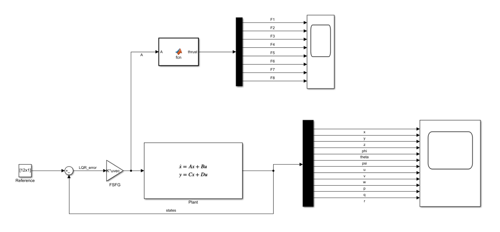

To implement this, we need the following:
State-space model: 
A and B matrices: These relate the derivative of the states with the current states and the control input. But, since our model is non-linear in nature, we cannot get a direct relation consisting of A and B matrices. Also, the LQR controller works only for Linear Systems. So, we have to linearise our system around an operating point. For our system, we took the origin in the world frame (initial point of the bot) as the operating point. Also, we used the position of the bot in the world frame and velocity of the bot in its own frame as the two states. Meaning:

(Here x is the state but not the distance in x direction)

Since,

The above state space model is clearly non-linear. So, we have to linearise to find A and B as follows:

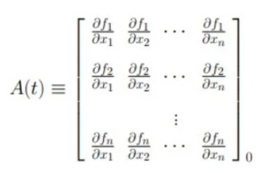

So, we obtain the A and B as follows:

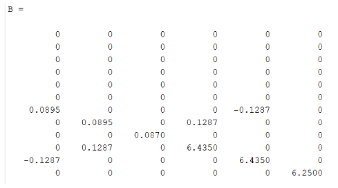

But we obtained the above results by taking weight W and buoyancy B as 110 N and 120 N respectively.

We take the C matrix in state-space (y=CX+DU) as eye(12) so as to send back all the states as feedback to the summing point.

Q and R matrices:
Q stands for the importance of the states to reach their desired values.
R stands for the cost of the control input. 
So, if we have an expensive control input compared to that of our needs to reach the states, we take the Q matrix to be dominating compared to R and vice versa. 

Then, we calculate the full-state feedback matrix, the Algebraic Riccati Equation and the eigenvalues by using the following command:
			[K,S,P] = lqr(A,B,Q,R)

Then, we put the obtained value of the Gain matrix in the state-space model in Simulink. The following results are obtained for different R matrices (Q matrix being a 12x12 identity matrix) and desired states being [1;2;1;0;0;0;0;0;0;0;0;0]:

For the above, the Poles of the closed loop and open loop transfer function are as follows:

**Poles:**

Closed loop(With the feedback):

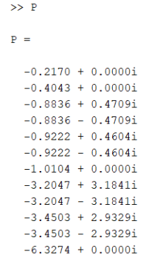

Open loop(Without the feedback):

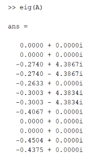

**Making ‘R’ more dominant:**

**Making ‘R’ less dominant:**

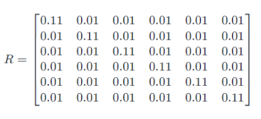

**Results:**
**a) Observed states:**

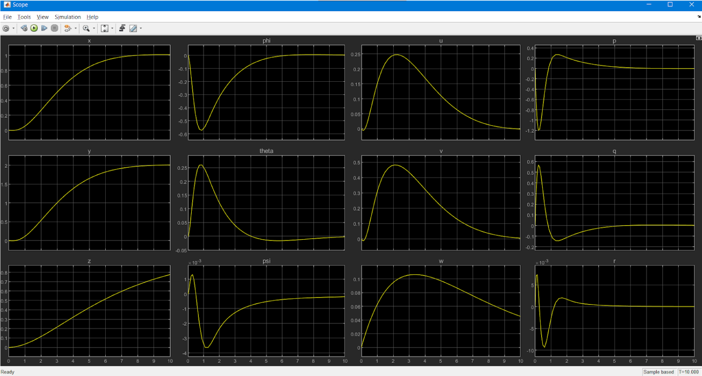

**More dominant ‘R’:**

**Less dominant ‘R’:**

**b)Thrust i/p to the thrusters:**

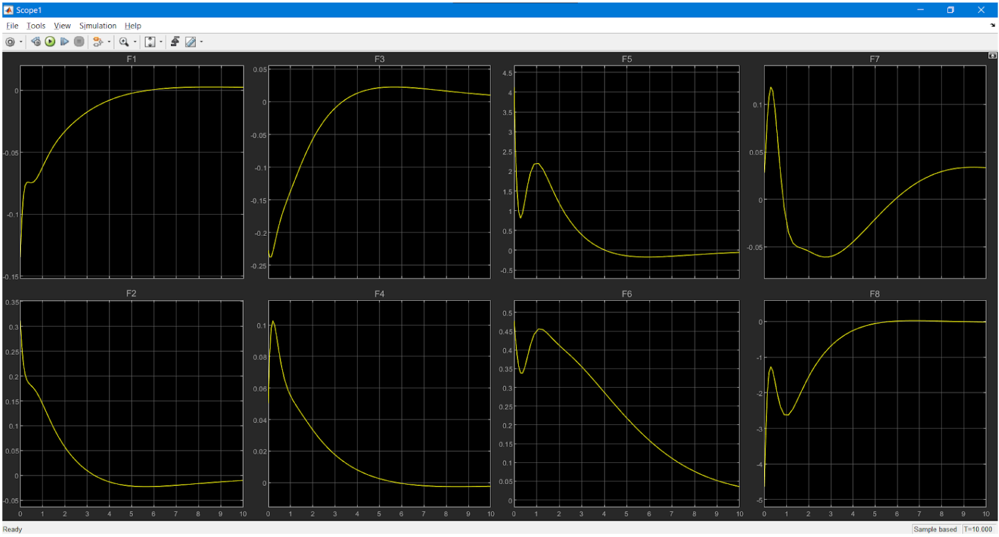

**More dominant ‘R’:**

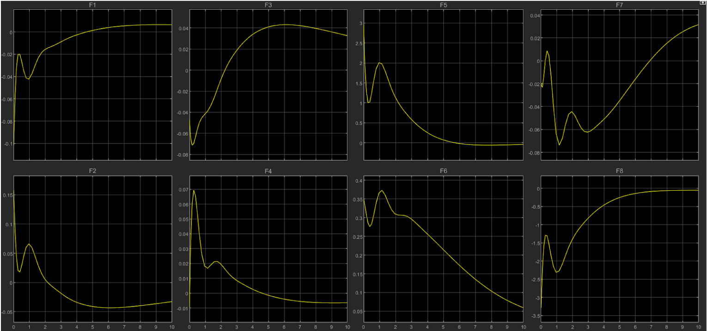

**Less dominant ‘R’:**

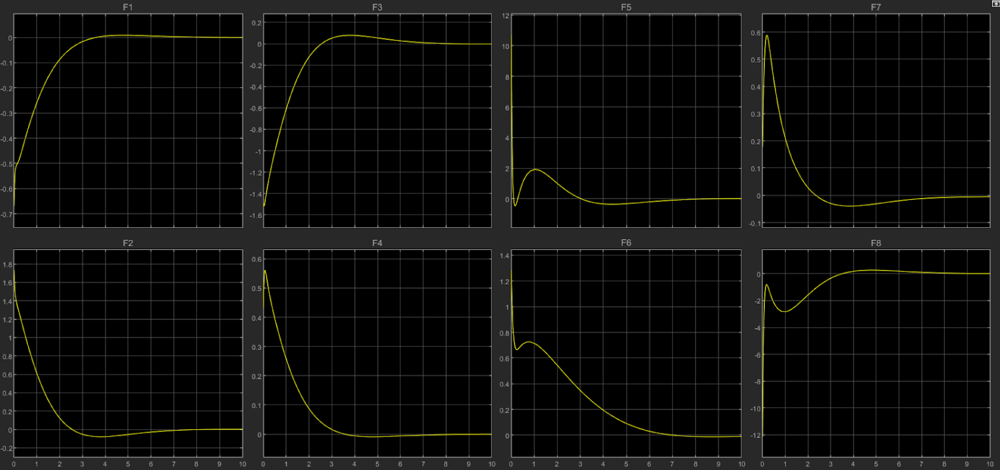

**Band Limited White Noise:**
We planned on modelling a system with White Noise. So, we used the following control system:

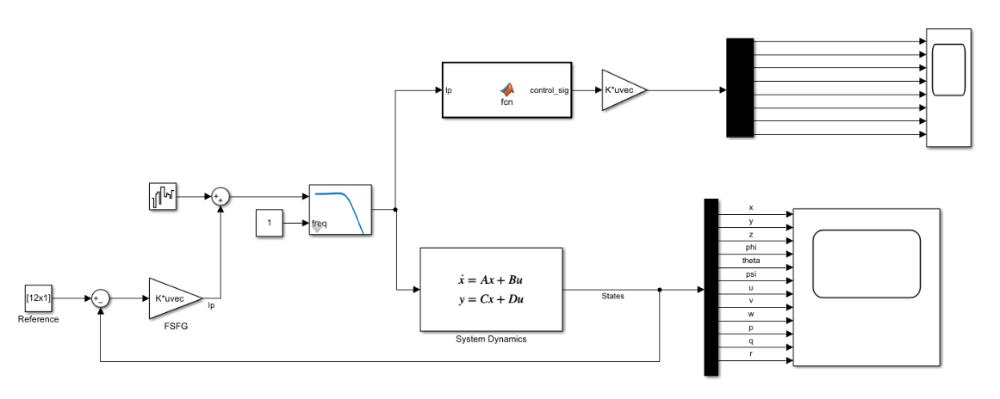

Where:

We included a low pass filter for removing noise with frequency greater than 1Hz. With low values of ‘Q’ we are getting really unstable results as the importance to the states is reduced. Later, we increased the value of Q to allow the states to reach quickly. This made the response of our system better. Taking the reference input as: [0;0;2;1.57;1;0.8;0;0;0;0;0;0];

1)Q = eye(12):
**States:**

**Thrust provided by each thruster:**

**Poles of this system:**

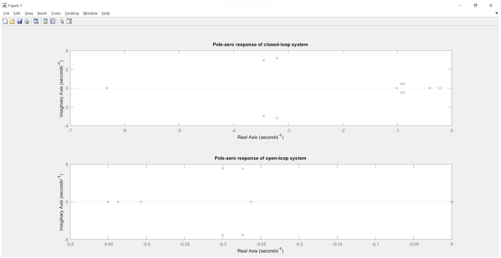

2)Q = 1000*eye(12):
**States:**

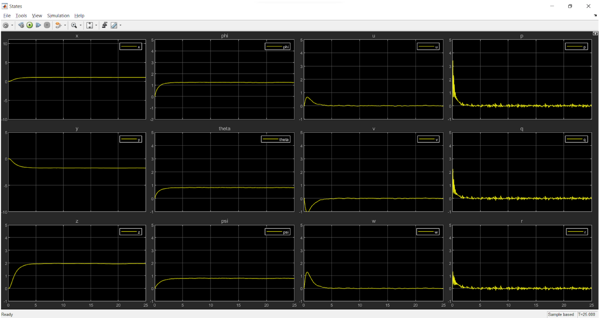

**Thrust provided by each thruster:**

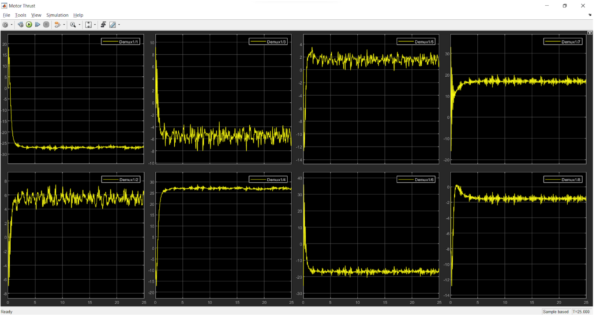

**Poles of this system:**

Clearly, the response of the system is faster in the second case. 
**Note:** In the above two cases, the open loop and closed loop pole plots are drawn without taking the noise into account. The effect of noise is shown only in the ‘Thrust’ and ‘States’ plots. 

Also, in the paper that we referred to, they considered noise caused due to the ‘current velocity’ which has a direct effect on the velocity of the rover instead of the torques. So, for that, a Random Number generator block was included in  the model as follows:

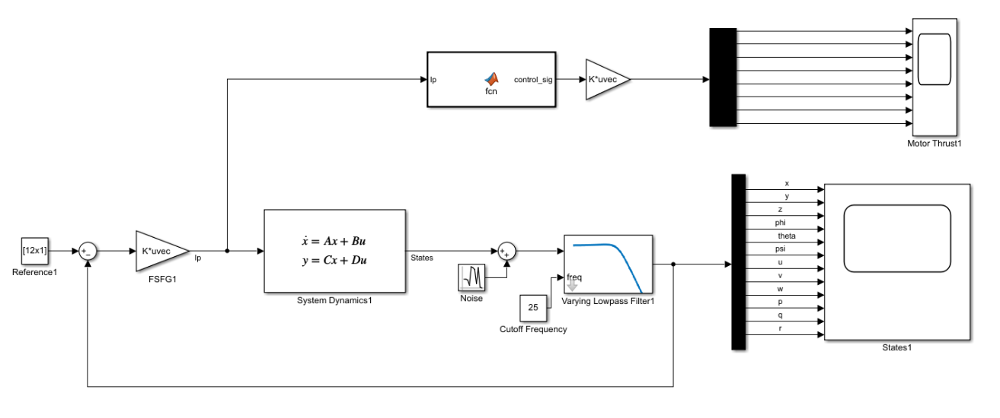

The parameters of the noise block are as follows:

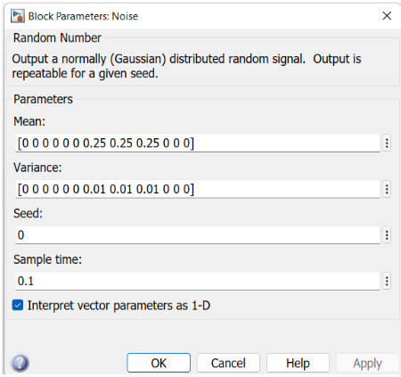

Here, noise is added considering the velocity of current as: [0.25,0.25,0.25] and taking the variance as 0.01 in all the three directions.

Taking R matrix as: R=1.2*eye(6)+0.8*ones(6)
And Q matrix as: Q=1000*eye(12);
The results that we obtained for 1min stop time  are:
**States:**

**Thrust provided by each thruster:**

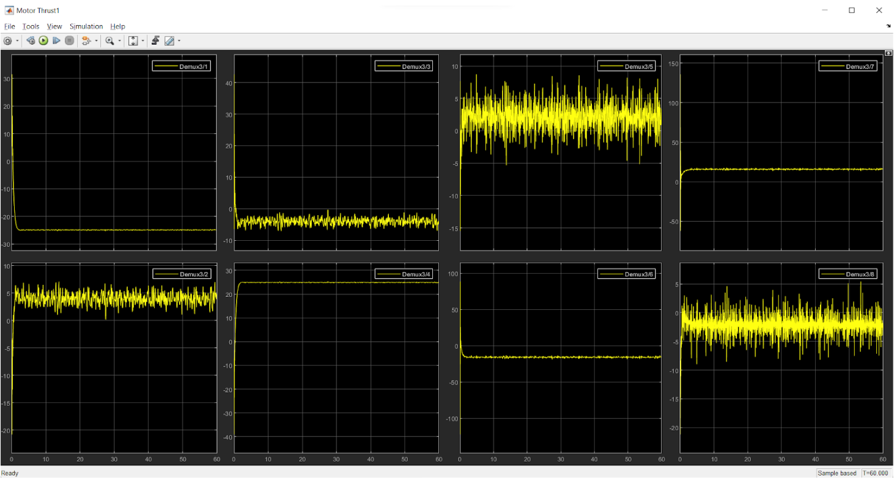

Clearly, the thrust output involves too much vibrations.

**Analysis of Eigenvalues:**
When we analyse the change in eigen values while considering the open loop and LQR controlled closed loop systems, for the same values of Q,R we see a clear change in their position in the pole zero plot.

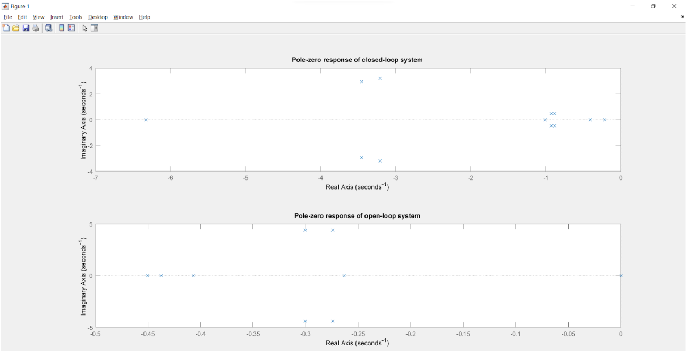

Considering the above plot, we can see a clear shift in the eigen values in the direction of the negative real axis, ensuring more stability of the system. As we write down the eigen values or the poles of the two systems, the difference becomes evident.
                                                                      
For   Q = eye(12) & R = 0.1*ones(12) + 0.9*eye(12) 

As it can be observed, in the case of the open loop system, we have four eigen values or poles located at the origin which leads to the fact that the system is marginally stable. Whereas, for the closed loop system, most of  the poles have shifted towards the left side of the imaginary axis with all the poles lying on the left half of the s-plane. This gives enough proof to say that after implementing LQR control, the system has become more stable as compared to the open loop system and hence has helped in increasing performance in terms of reaching the end states. 

**Conclusion:**
Given the results of implementing both PID and LQR control on the ROV system, we can see a better response for an LQR control over the PID when we include disturbances in the environment. Also, the LQR control is far more robust in adapting to the change in buoyancy as compared to the PID control, which broadens the spectrum of usage in the former as compared to the latter. When we have changes in the system, using a PID requires tuning all the three gain values for all the control inputs. Tuning the gain values for multiple parameters is not an easy task and there is a very narrow range of values which give the desired results for a specific situation. On the other hand, when we want to adapt to changes while working on LQR control, our tuning is dependent only on the Q,R cost matrices which can help in changing the  relative importance of the states and control inputs for a given circumstance. Here, our goal is achieved by changing the values of the matrices, so as to select the more important factor among the states and inputs,  where we achieve the desired results for a wide range of values which only differ in terms of speed of transient response and steady state error. Another advantage of LQR over PID control that we have come across was the ability to easily control velocity components along with the position coordinates, which would lead to much more complexity in the case of a PID based controller. For simulating in a noisy environment, we used nonlinear PID control where a water current velocity was added as a disturbance; its value being constant with time and we attained appreciable results. Whereas for the LQR setup, we have used a gaussian white noise as a source of disturbance, which gives a better look at the real world scenario. Upon increasing the Q matrix or simply, the cost of attaining the states, we have observed better performance in attaining the states and less erratic, more uniform thrust outputs produced by the thrusters; which is a more reliable result since it is realisable in a real world environment. 
However, one drawback of using the LQR control is its applicability to only linear systems, whereas most of the real world scenarios tend to have non linearity in them. However, this problem can be overcome by linearising the system near the fixed points and applying the control.

Hence, we have come to the conclusion that using an LQR control is far more reliable than a PID control for the positional and velocity control of a 6-DOF Autonomous Underwater Vehicle.

---